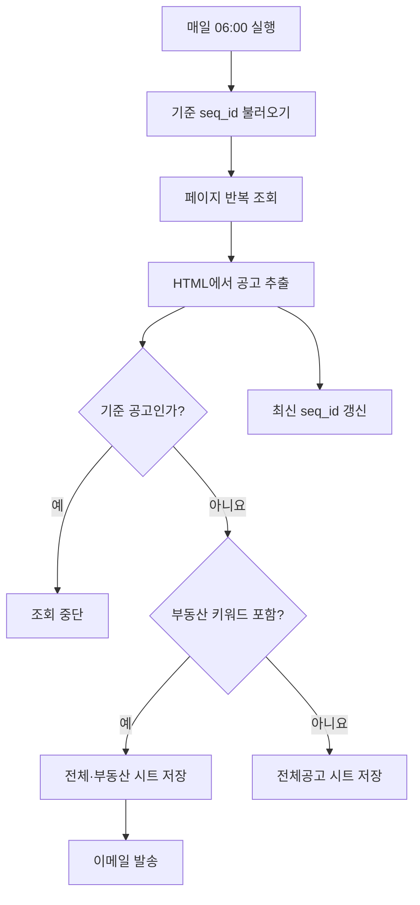
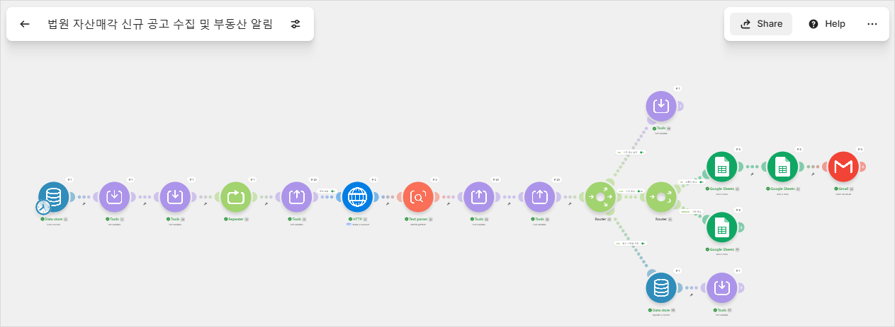
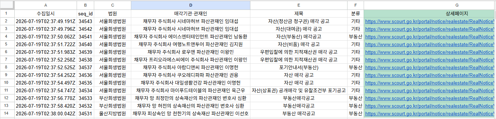
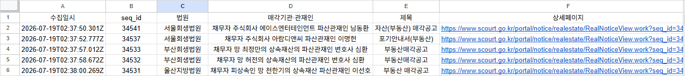
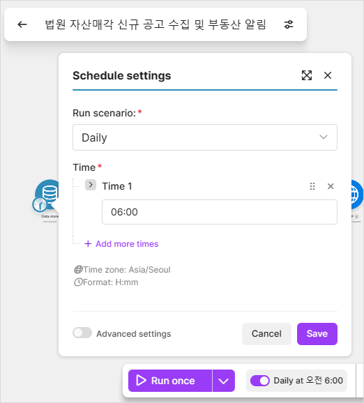

# 프로젝트 2: 법원 자산매각 신규 공고 수집 및 부동산 알림

## 1. 프로젝트 개요

법원 회생·파산 자산매각 공고 게시판을 매일 확인하고 신규 공고를 구글 시트에 옮기는 반복 작업을 자동화했다. 전체 신규 공고는 `전체공고` 시트에 저장하고, 제목에 부동산 관련 키워드가 포함된 공고는 `부동산공고` 시트에 별도로 저장한 뒤 이메일로 알린다.

- 데이터 출처: 대한민국 법원 자산매각 공고 게시판
- 자동화 도구: Make
- 실행 시각: 매일 오전 6시 (`Asia/Seoul`)
- 중복 판별 기준: 공고 상세주소의 고유값 `seq_id`
- 선택 보너스 과제(AI 연동, 실패 알림 및 재시도)는 구현 범위에서 제외했다.

## 2. 반복 업무 정의

기존에는 사용자가 법원 게시판에 직접 접속해 여러 페이지의 신규 공고를 확인하고, 부동산 관련 공고를 찾아 별도로 기록해야 했다. 게시물이 하루에 30건 이상 등록될 수 있어 첫 페이지만 확인하면 일부 공고가 누락될 수 있고, 이미 본 공고를 다시 확인하는 비효율도 발생한다.

이 프로젝트에서는 다음 작업을 자동화 대상으로 정했다.

1. 정해진 시각에 법원 공고 게시판 확인
2. 직전 확인 이후 등록된 신규 공고 식별
3. 신규 공고의 법원, 매각기관·관재인, 제목 및 상세주소 수집
4. 전체 신규 공고를 구글 시트에 저장
5. 부동산 관련 공고를 별도 시트에 저장하고 이메일 발송
6. 기존 공고를 발견하면 추가 페이지 조회 중단

## 3. Make 선정 이유

Make는 모듈과 Router가 시각적으로 표시되어 페이지 반복, 중복 판별, 부동산 분류처럼 분기가 많은 흐름을 한 화면에서 파악하기 쉽다. 또한 시나리오 화면의 확대·축소·이동이 편리하고, HTTP·Text Parser·Data Store·Google Sheets·Gmail을 하나의 워크플로우로 연결할 수 있어 이번 자동화에 적합하다고 판단했다.

## 4. 요구사항 충족

| 구분 | 구현 내용 |
|---|---|
| Trigger | 매일 오전 6시 자동 실행 |
| Action | HTTP 페이지 조회, HTML 파싱, Data Store 갱신, Google Sheets 행 추가, Gmail 발송 |
| Filter/Router | 기존·신규 공고 분기, 부동산·기타 공고 분기 |
| 자동 실행 | Make Scheduling을 `Daily 06:00`, `Asia/Seoul`로 설정 |
| 실제 실행 | 기타 및 부동산 분기 모두 실행하고 시트 저장과 이메일 수신 확인 |

## 5. 워크플로우 설계



### 단계별 동작

1. Data Store에서 직전 실행의 최신 `seq_id`를 불러온다.
2. `stop_flag`와 `checkpoint_saved` 변수를 초기화한다.
3. Repeater가 1페이지부터 최대 20페이지까지 페이지 번호를 생성한다.
4. `stop_flag = 0`일 때만 HTTP 모듈이 해당 페이지를 조회한다.
5. Text Parser가 페이지의 공고를 각각의 Bundle로 변환하고 다음 값을 추출한다.
   - 게시판 번호
   - 법원
   - 매각기관·관재인
   - 제목
   - 상세페이지 경로
   - `seq_id`
6. 현재 `seq_id`가 Data Store의 기준값과 같으면 `stop_flag`를 1로 바꾸어 이후 페이지 조회를 막는다.
7. 기준값과 다른 공고는 신규 공고로 처리한다.
8. 제목에 부동산 키워드가 있으면 `전체공고`와 `부동산공고` 시트에 모두 저장하고 이메일을 발송한다.
9. 그 밖의 신규 공고는 `전체공고` 시트에만 저장한다.
10. 첫 페이지의 첫 공고를 새로운 기준값으로 Data Store에 저장한다.

최대 20페이지는 기준 공고가 삭제되거나 게시판 구조가 달라졌을 때 불필요한 요청이 계속되는 것을 방지하기 위한 안전장치다. 실제로는 기존 `seq_id`를 발견하는 즉시 이후 HTTP 요청이 Filter에서 차단된다.

## 6. 부동산 분류 기준

공고 제목에 다음 단어 중 하나가 포함되면 부동산 공고로 분류한다.

```text
부동산, 토지, 건물, 아파트, 주택, 상가, 오피스텔, 공장, 대지, 임야
```

`매각`, `자산`, `매각허가`처럼 부동산 이외의 자산에도 사용될 수 있는 일반적인 단어는 분류 기준에서 제외했다.

## 7. 저장 데이터

### 전체공고

| 열 | 내용 |
|---|---|
| 수집일시 | Make 실행 시각 |
| seq_id | 공고 고유번호 |
| 법원 | 공고를 게시한 법원 |
| 매각기관·관재인 | 매각 담당 기관 또는 파산관재인 |
| 제목 | 공고 제목 |
| 분류 | 부동산 또는 기타 |
| 상세페이지 | 클릭 가능한 공고 상세주소 |

### 부동산공고

`전체공고`와 동일한 주요 정보를 저장하되, 부동산으로 분류된 공고만 기록한다. 상세페이지 주소는 다음 형식으로 생성했다.

```text
https://www.scourt.go.kr/portal/notice/realestate/RealNoticeView.work?seq_id={공고ID}
```

## 8. 테스트 및 실행 결과

조건 분기의 실제 실행을 확인하기 위해 Data Store의 테스트 기준값을 `34530`으로 설정한 뒤 시나리오를 실행했다.

| 확인 항목 | 결과 |
|---|---|
| 조회 페이지 | 2페이지 |
| 전체 신규 공고 | 13건 (`34543`~`34531`) |
| 부동산 공고 | 5건 |
| 기타 공고 분기 | 실행 확인 |
| 부동산 공고 분기 | 실행 확인 |
| 이메일 | 부동산 공고 정보 및 상세페이지 링크 수신 확인 |
| 조회 중단 | 기준 공고 `34530` 발견 후 실행 확인 |
| 기준값 갱신 | 실행 후 최신 공고 `34543`으로 자동 갱신 |

테스트 과정에서 기준값을 수동으로 낮춰 실제 게시물을 신규 공고처럼 재처리했으며, 최종 결과 화면에서는 이전 테스트로 생성된 중복 행을 제거하고 `34530` 기준의 실행 결과만 남겼다.

## 9. 구현 및 실행 화면

### 9.1 Make 전체 시나리오 및 실행 결과



### 9.2 전체 신규 공고 저장 결과



### 9.3 부동산 공고 분리 저장 결과



### 9.4 부동산 공고 이메일 알림


### 9.5 오전 6시 자동 실행 설정



## 10. 한계 및 개선 방향

- 제목 기반 키워드 분류이므로 본문에만 부동산 정보가 있는 공고는 놓칠 수 있다.
- 게시판 HTML 구조가 변경되면 Text Parser 정규식을 수정해야 한다.
- 기준 공고가 최대 조회 범위인 20페이지 밖으로 밀리면 일부 과거 공고까지 신규로 처리할 수 있다.
- Google Sheets의 수집일시는 연결 환경에 따라 ISO 8601 형식으로 표시될 수 있으나, 자동 실행 스케줄은 `Asia/Seoul` 오전 6시로 설정했다.
- 향후에는 상세 본문이나 첨부파일까지 분석하여 부동산 분류 정확도를 높일 수 있다.

## 11. 결론

이 프로젝트를 통해 반복적인 법원 공고 확인 업무를 Make로 자동화했다. 정해진 시각에 게시판을 확인하고, `seq_id`를 기준으로 신규 공고만 수집하며, 기존 공고를 발견하면 페이지 조회를 중단한다. 또한 Router를 이용해 부동산과 기타 공고를 분리하고, 부동산 공고만 별도 시트 및 이메일로 전달하는 실제 동작 가능한 워크플로우를 구현했다.
